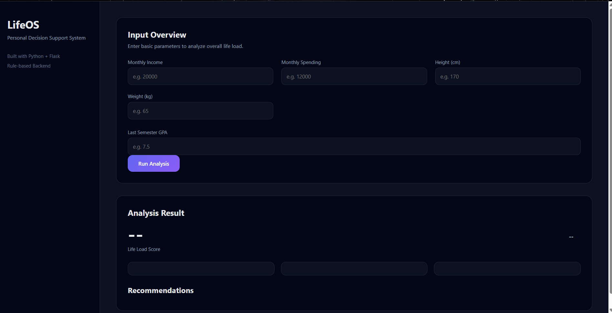
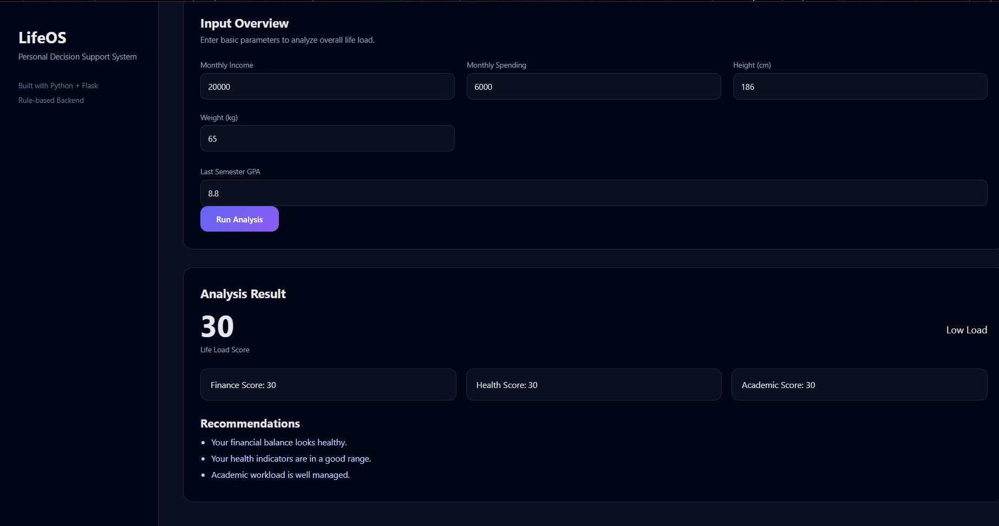
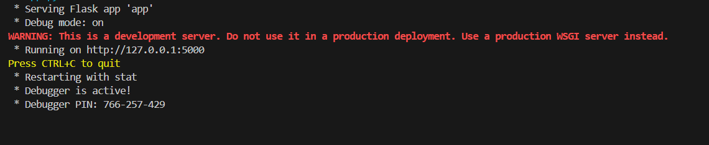

# Personal Life Systems Dashboard

## Overview
A rule-based backend-driven web application that analyzes a student's
financial, health, and academic load to provide a unified life stress score.
The system focuses on decision support rather than isolated calculations.

## Features
- Finance load analysis
- Health risk evaluation (BMI based)
- Academic pressure scoring
- Aggregated Life Load Score with recommendations

## Tech Stack
- Backend: Python, Flask
- Frontend: HTML, CSS (basic)
- Logic: Rule-based system

## Why this project?
Instead of building isolated tools, this project unifies multiple
real-life systems into one personal decision support dashboard.
The primary focus is backend logic and system design.

## Screenshots

### Input Interface

### Analysis Result

### Backend Running

## Project Structure
Personal-Life-Dashboard/
│
├── backend/
│ ├── app.py
│ ├── logic.py
│ └── requirements.txt
│
├── frontend/
│ └── index.html
│
├── screenshots/
│
├── README.md
└── .gitignore